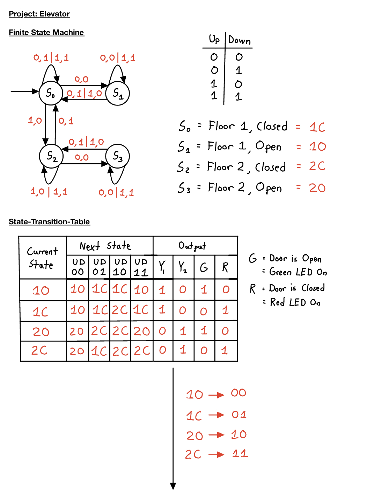
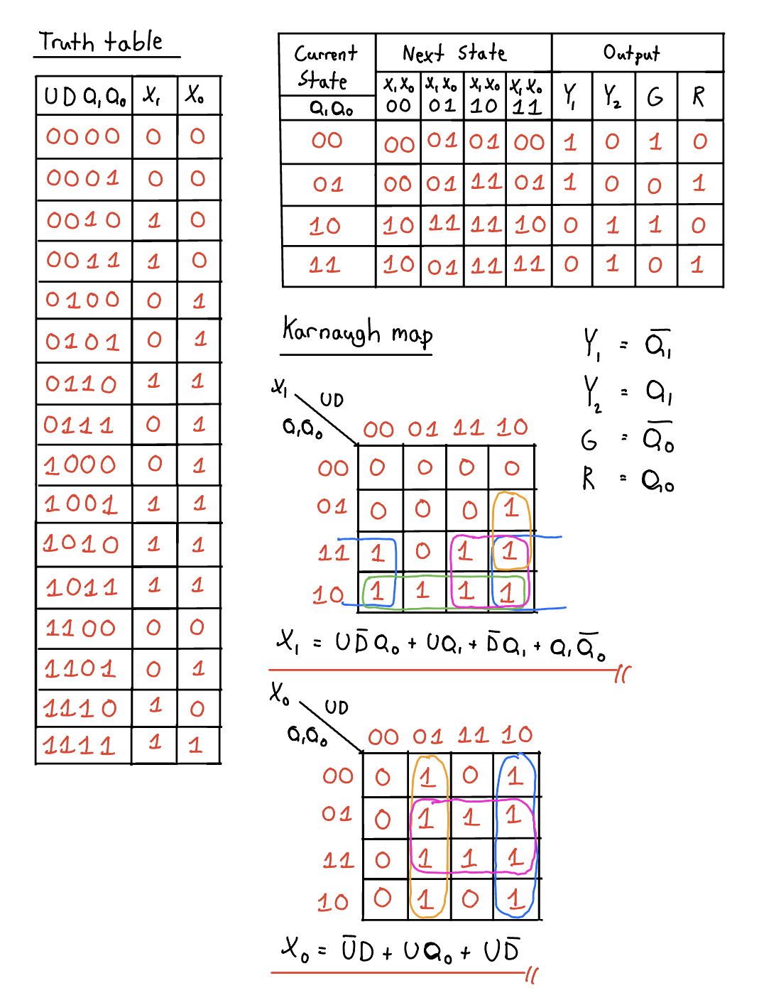
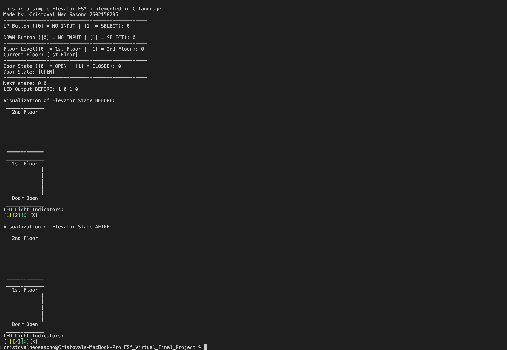
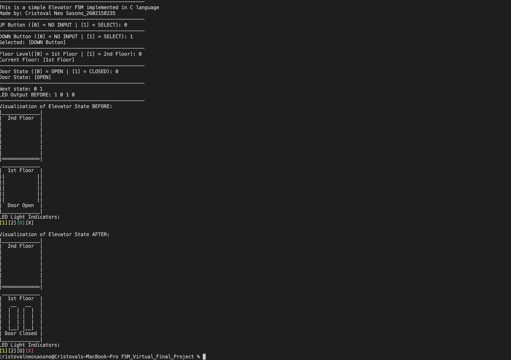
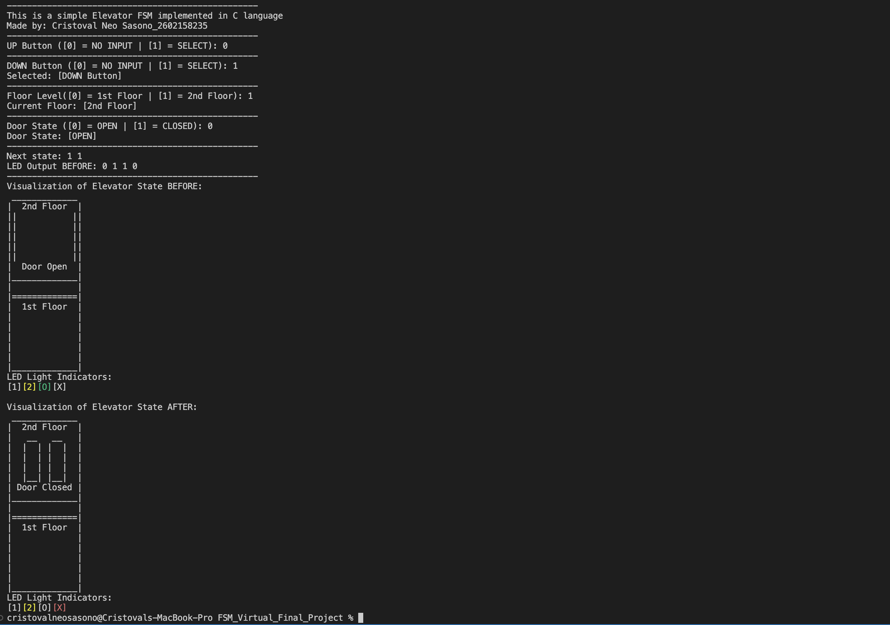

Made by: Cristoval Neo Sasono_2602158235

# Elevator FSM in C Language 

## Table of contents

- [Introduction](#introduction)
- [FSM Model](#fsm-model)
- [Running the Code](#running-the-code)
- [Test Examples](#test-examples)
- [Updates](#updates)

## Introduction

This is an Elevator system modelled using an FSM (Finite State Machine) and implemented using the C language.

# FSM Model

    Current State = Floor State | Door State
    Next State = Floor State | Door State
    Output = 1st LED | 2nd LED | Green | Red

    U = Up Button
    D = Down Button
    Floor State -> [1 (1st Floor)] = 0 and [2 (2nd Floor)] = 1
    Door State -> [O (Open)] = 0 and [C (Closed)] = 1

    1st LED = 1st Floor LED
    2nd LED = 2nd Floor LED
    Green = Green LED, signifying the doors are open
    Red = Red LED, signifying the doors are closed
    

From the State-Transition-Table, Truth Table, and K-map is dirived both X1 (Floor Level State) and X0 (Door State) equations used in the implementation using C language: 

    [X1] = (U_Select & (!D_Select) & Door_state) | (U_Select & Floor_lvl) | 
           ((!D_Select) & Floor_lvl) | ((!Door_state) & Floor_lvl)
    [X0] = ((!U_Select) & D_Select) | (U_Select & Door_state) | (U_Select & (!D_Select))

    U_Select = Up Button
    D_Select = Down Button

The well as the state of the LEDs: 

    [Y1] = !Floor_lvl; -> !Q1 = First Floor -> 1st floor LED will light up
    [Y2] = Floor_lvl; -> Q1 = Second Floor -> 2nd floor LED will light up
    [G] = !Door_state; -> !Q0 = Door state -> Green LED will light up, signifying the doors are opened
    [R] = Door_state; -> Q0 = Door state -> Red LED will light up, signifying the doors are closed

# Running the code

Here are the following steps to run and test the code:
1. Download all the necessary files and open them in your IDE or directly through Terminal (Open to the correct directory).
2. In your terminal, type: 'make', which will compile the files and run it.
3. To run it again, simply type: 'make run', which will run the code again.
4. To clear all .o and .out files, type: 'make clear'.

Here are a brief description of the variables:

    User Input = 
    [Up] -> [0] = NO INPUT | [1] = SELECT
    [Down] -> [0] = NO INPUT | [1] = SELECT
    [Floor Level] -> [0] = 1st Floor | [1] = 2nd Floor
    [Door State] -> [0] = OPEN | [1] = ClOSED
    --------------------------------------------------------------
    Output = 
    Next State = [Floor Level] [Door State]
    LED Output BEFORE = [Y1] [Y2] [G] [R]
    --------------------------------------------------------------
    Description:
    [Y1] = 1st Floor LED | [Y2] = 2nd Floor LED 
    [G] = Green LED (Door Open) | [R] = Red LED (Door Closed)   

# Test Examples - Version 1.0

Here are some of the results of the tests I've conducted by myself.

    Description:
    User Input = [Up] [Down] [Floor Level] [Door State]
    Next State = [Floor Level] [Door State]
    LED Output BEFORE = [Y1] [Y2] [G] [R]

---
    Test 1 = 0 0 0 0
    Expected Results:
    Next State: 0 0
    LED Output BEFORE: 1 0 1 0

 

    Test 2 = 0 1 0 0
    Expected Results:
    Next State: 0 1
    LED Output BEFORE: 1 0 1 0

    Test 3 = 0 1 1 0
    Expected Results:
    Next State: 1 1
    LED Output BEFORE: 0 1 1 0

# Updates

    Version 1.0:
    - Released on 2 January 2023
    
    Version 1.1:
    - Updated on 9 January 2023
    - Allows the code to continue running indefinitely until the user quits.
    - Simulation will now retain the state of the 'Floor_lvl' of the elevator. No need to redeclare the 'Floor_lvl' state.
